<p align="center">
    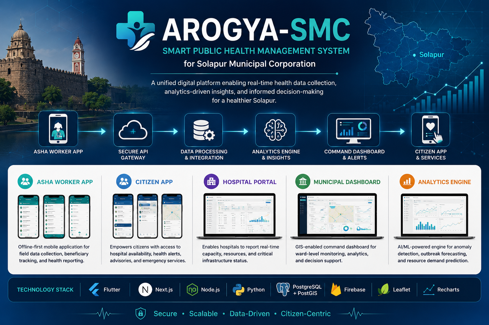
</p>
<h1 align="center">Arogya-SMC</h1>

<p align="center">
Smart Public Health Monitoring & Decision Support System
<br>
for Solapur Municipal Corporation
</p>

<p align="center">


</p>

---

## Contents

- Overview
- Recognition
- Problem Statement
- Solution Overview
- Platform Overview
- System Architecture
- Platform Modules
- Technology Stack
- Repository Structure
- Project Demonstration
- Technical Documentation
- Contributors
- Future Scope
- License

---

# Overview

Arogya-SMC is a smart public healthcare platform designed for **Solapur Municipal Corporation (SMC)** to improve disease surveillance, municipal healthcare operations, and citizen health services through a unified digital ecosystem.

The platform integrates multiple healthcare stakeholders—including ASHA workers, hospitals, citizens, and municipal authorities—into a centralized system for real-time reporting, analytics, and decision support.

Unlike traditional municipal healthcare workflows that depend on fragmented records and delayed reporting, Arogya-SMC provides a modular digital platform capable of supporting field data collection, healthcare monitoring, ward-level analytics, and public health administration. The project addresses the challenge of fragmented health information across ASHA workers, hospitals, and laboratories while enabling centralized monitoring and structured decision support. :contentReference[oaicite:0]{index=0}

---

# Recognition

Arogya-SMC was developed for the **SAMVED 2026 Innovation Challenge**.

The project was selected among the **Top 7 teams** from **546 participating teams across 10 states**, recognizing the team's approach to solving municipal public healthcare challenges through an integrated digital platform.

The official selection document is available in:

```text
assets/
└── Achievements/
    └── achievement.pdf
```

---

# Project Demonstration

The complete prototype demonstration is available on YouTube.

**Demo Video**

https://youtu.be/0s_siwg91rY

---

# Problem Statement

Municipal healthcare systems often operate using disconnected data sources distributed across ASHA workers, hospitals, laboratories, and administrative departments.

This results in:

- fragmented health records
- delayed disease reporting
- manual data consolidation
- limited ward-level visibility
- inefficient resource allocation
- delayed public health response

The absence of a centralized health information platform prevents municipal authorities from identifying emerging disease trends and making timely, evidence-based decisions. :contentReference[oaicite:1]{index=1}

---

# Solution

Arogya-SMC proposes an integrated Smart Public Health Monitoring & Decision Support System that connects field workers, hospitals, citizens, and municipal authorities through a centralized digital platform.

The system focuses on:

- Digital field reporting
- Structured healthcare data collection
- Disease surveillance
- Municipal decision support
- Citizen healthcare services
- Healthcare resource monitoring
- Real-time analytics
- Public health awareness

The proposed platform follows a modular architecture that enables secure data collection, standardization, analytics, and visualization while supporting future expansion toward interoperable municipal healthcare systems. :contentReference[oaicite:2]{index=2}

---

# Platform Overview

The ecosystem consists of five major components working together.

| Component | Purpose |
|-----------|---------|
| ASHA Worker Application | Field data collection and healthcare reporting |
| Citizen Application | Public health services and advisories |
| Hospital Portal | Hospital capacity and disease reporting |
| Municipal Dashboard | Analytics, monitoring and decision support |
| Backend Services | Centralized data processing and API services |
---

# Platform Overview

Arogya-SMC is designed as a multi-platform healthcare ecosystem where each component serves a specific stakeholder while remaining connected through centralized backend services.

The platform consists of independent applications for ASHA workers, citizens, healthcare administrators, and municipal authorities, enabling efficient data collection, healthcare monitoring, and evidence-based decision-making.

---

# Platform Modules

<table>
<tr>
<td align="center" width="33%">

## ASHA Worker Application

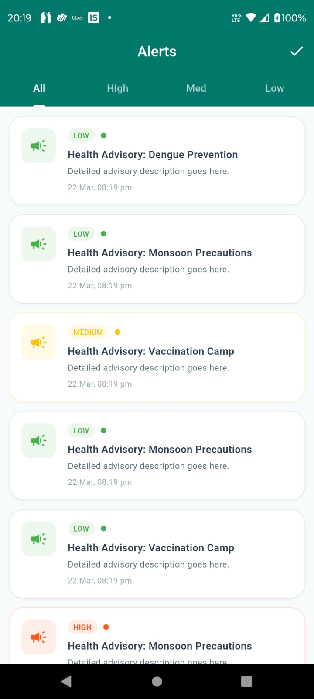

Designed for Accredited Social Health Activists (ASHAs), this application enables healthcare workers to digitally record household surveys, monitor pregnancies, track immunization schedules, report communicable diseases, and synchronize field data with the central platform.

</td>

<td align="center" width="33%">

## Citizen Application

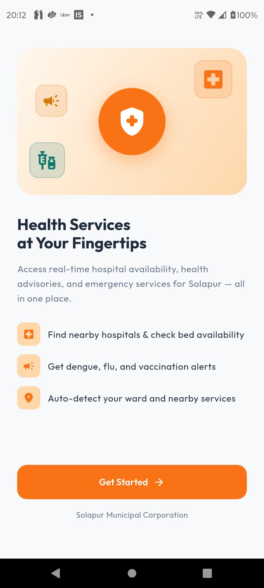

Provides citizens with access to health-related services, public advisories, awareness initiatives, and communication with municipal healthcare systems through a mobile-first interface.

</td>

<td align="center" width="33%">

## Municipal Dashboard

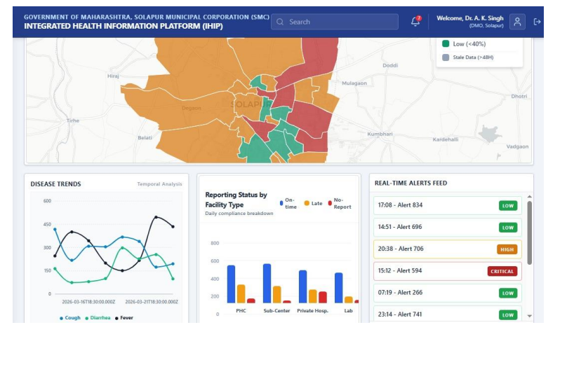

A centralized dashboard designed for municipal authorities to visualize healthcare trends, monitor disease statistics, evaluate ward-level indicators, and support public health planning.

</td>
</tr>
</table>

---

# Application Gallery

## ASHA Worker Application

<p align="center">

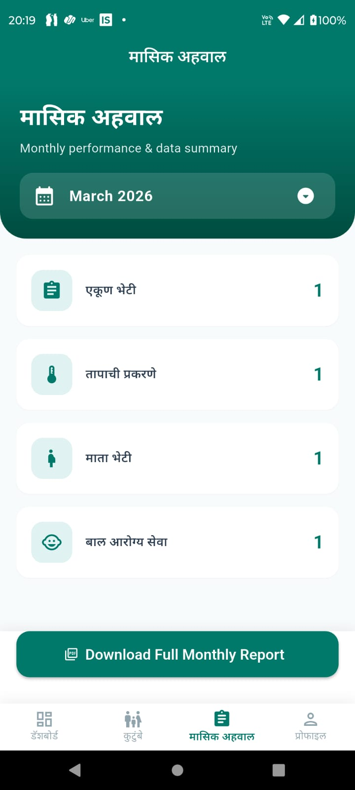
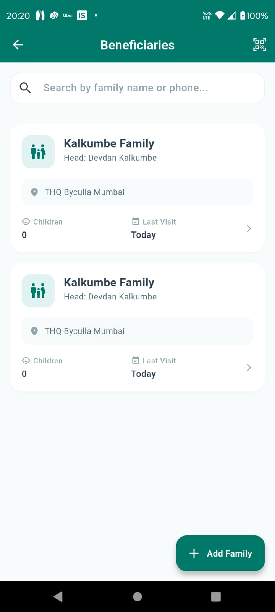
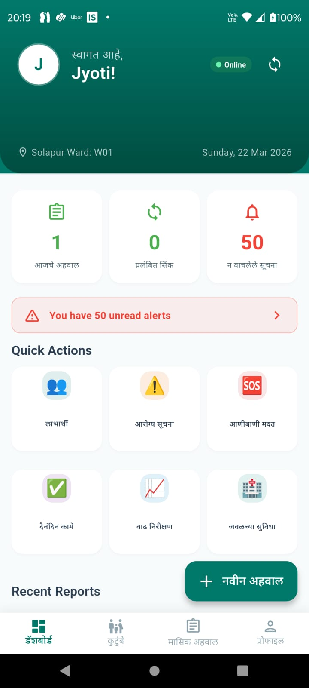
</p>

The ASHA application digitizes field operations by replacing manual registers with structured digital workflows. It enables healthcare workers to capture demographic information, conduct household surveys, report health events, and synchronize collected data with the municipal platform.

---

## Citizen Application

<p align="center">

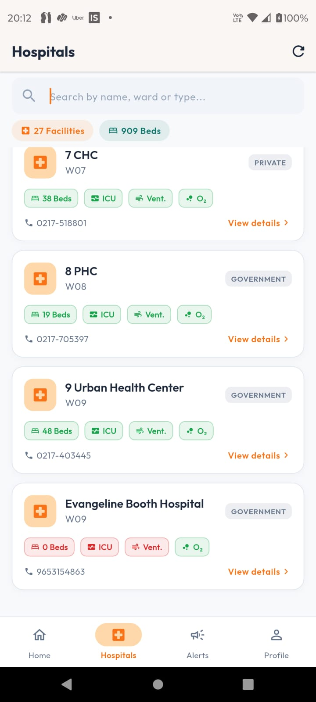
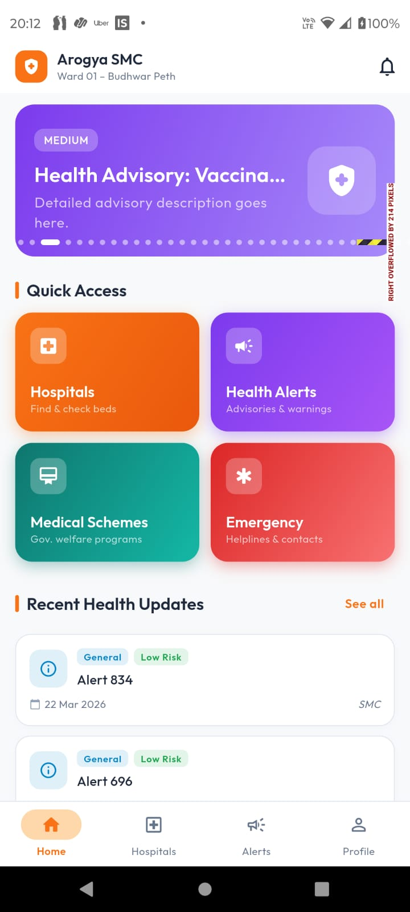
</p>

The citizen application focuses on improving public engagement by providing healthcare information, awareness campaigns, and simplified access to municipal health services through an intuitive mobile interface.

---

## Municipal Dashboard

<p align="center">

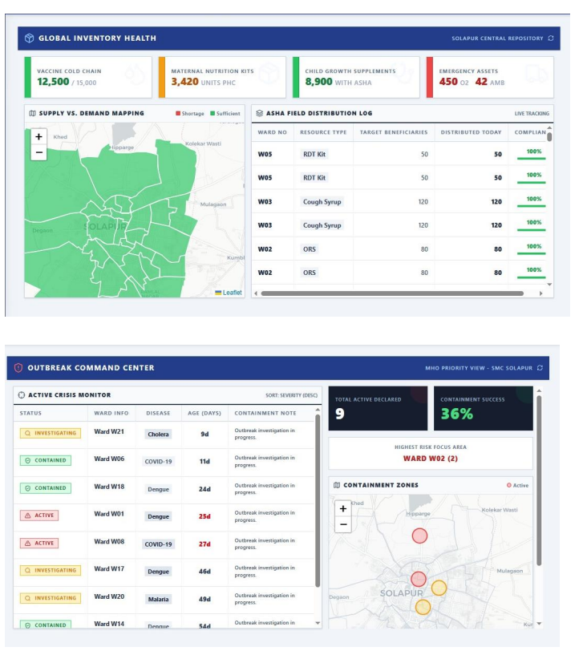
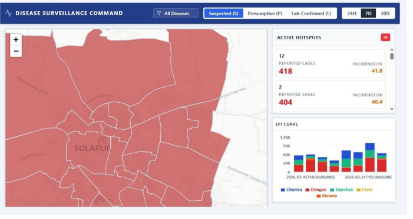
</p>

The Municipal Dashboard aggregates information from multiple stakeholders and presents interactive visualizations to support healthcare administrators. It enables monitoring of disease distribution, demographic indicators, healthcare resources, and operational performance across municipal wards.

---

# System Architecture

The Arogya-SMC ecosystem follows a modular architecture that separates client applications, backend services, data storage, analytics, and administrative interfaces. This design improves maintainability while allowing independent development of platform components. :contentReference[oaicite:0]{index=0}

<p align="center">
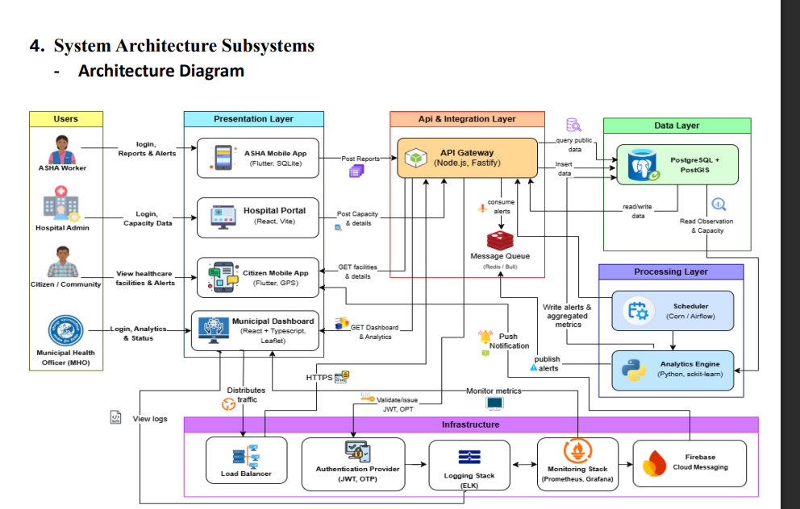
</p>

---

# Context Diagram

The context diagram illustrates the interaction between external stakeholders—including citizens, ASHA workers, hospitals, laboratories, and municipal authorities—and the centralized healthcare platform. It highlights the flow of healthcare information across organizational boundaries while maintaining a unified data ecosystem. :contentReference[oaicite:1]{index=1}

<p align="center">
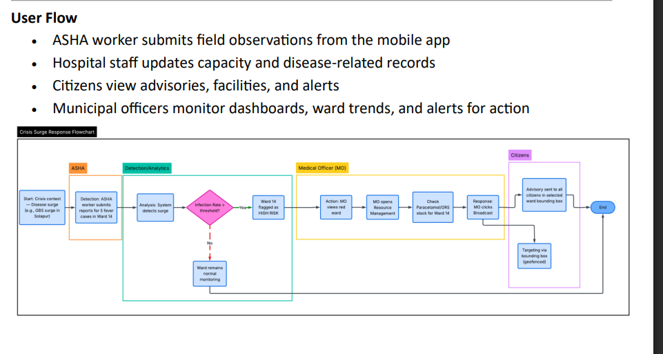
</p>

---

# Data Flow

The platform processes information through a structured workflow beginning with data collection, followed by validation, centralized storage, analytics, visualization, and decision support. This architecture enables timely reporting and supports municipal public health operations. :contentReference[oaicite:2]{index=2}

<p align="center">
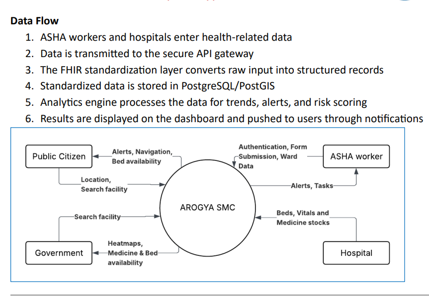
</p>

---
# Key Features

Arogya-SMC is designed as a modular public healthcare platform that supports multiple stakeholders while providing municipal authorities with centralized visibility into healthcare operations.

## Core Features

- Digital household survey management
- ASHA worker field reporting
- Citizen health service interface
- Disease surveillance and monitoring
- Municipal health analytics dashboard
- Centralized healthcare database
- Role-based authentication and authorization
- Ward-level healthcare monitoring
- Health awareness and advisory dissemination
- Interactive dashboards for decision support
- Modular backend services
- Scalable architecture for future expansion

---

# Functional Modules

The platform is organized into independent modules that collaborate through centralized backend services.

| Module | Description |
|---------|-------------|
| Household Survey Management | Digitized household data collection by ASHA workers |
| Disease Surveillance | Monitoring and reporting of communicable diseases |
| Citizen Services | Public health information and service access |
| Healthcare Administration | Management of healthcare records and operational data |
| Municipal Analytics | Visualization of healthcare indicators and trends |
| Notification Services | Dissemination of alerts, reminders, and public advisories |
| Authentication | Secure access for different stakeholder roles |
| Data Management | Centralized storage and retrieval of healthcare information |

---

# Repository Architecture

The Arogya-SMC ecosystem is maintained as multiple repositories to promote modular development and independent deployment of platform components.

| Repository | Description |
|------------|-------------|
| **Arogya-Smc-Platform-Documentation** | Central documentation, reports, architecture diagrams, screenshots, and project overview |
| **arogya-smc-platform** | Municipal dashboard and administrative platform |
| **arogya-smc-ASHA-app** | Flutter application for ASHA workers |
| **arogya-asha-app-backend** | Backend services supporting the ASHA application |
| **arogya-smc-public-app** | Citizen mobile application |
| **arogya-public-app-backend** | Backend services supporting the Citizen application |

---

# Repository Links

| Component | Repository |
|-----------|------------|
| Documentation | https://github.com/Hyper-Hickory/Arogya-Smc-Platform-Documentation |
| Municipal Platform | https://github.com/Hyper-Hickory/arogya-smc-platform |
| ASHA Application | https://github.com/Hyper-Hickory/arogya-smc-ASHA-app |
| ASHA Backend | https://github.com/Hyper-Hickory/arogya-asha-app-backend |
| Citizen Application | https://github.com/Hyper-Hickory/arogya-smc-public-app |
| Citizen Backend | https://github.com/Hyper-Hickory/arogya-public-app-backend |

---

# Project Structure

```text
Arogya-Smc-Platform-Documentation
│
├── assets
│   ├── architecture
│   ├── achievements
│   ├── banner.png
│   ├── asha_app_1.jpeg
│   ├── asha_app_2.jpeg
│   ├── asha_app_3.jpeg
│   ├── asha4.jpeg
│   ├── public_app1.jpeg
│   ├── public_app2.jpeg
│   ├── public_app3.jpeg
│   ├── Municipal_dashboard_1.png
│   ├── Municipal_dashboard_2.png
│   └── Municipal_dashboard_3.png
│
├── documentation
│   ├── Project_Report.pdf
│   ├── Idea_Submission.pdf
│   └── ...
│
└── README.md
```

---

# System Workflow

The operational workflow of the Arogya-SMC platform follows a structured lifecycle from field-level data collection to administrative decision-making.

1. ASHA workers collect healthcare information using the mobile application.
2. Citizens interact with municipal healthcare services through the citizen application.
3. Backend services validate and process incoming healthcare records.
4. Information is securely stored in centralized databases.
5. Municipal dashboards aggregate healthcare information.
6. Analytics modules generate insights for administrators.
7. Municipal authorities monitor trends and support evidence-based public health decisions.

This workflow enables timely reporting, improved visibility, and data-driven healthcare management across the municipal ecosystem. :contentReference[oaicite:0]{index=0}

---

# Design Principles

The project was developed around the following engineering principles:

- Modular architecture
- Scalability
- Maintainability
- Separation of concerns
- Secure data management
- Role-based access
- User-centric interfaces
- Extensibility for future municipal healthcare requirements

---
# Technology Stack

The project combines modern web, mobile, backend, and database technologies to provide an integrated public healthcare platform.

## Implemented Prototype

| Category | Technologies |
|----------|--------------|
| Mobile Applications | Flutter |
| Frontend | React.js |
| Backend | Node.js |
| Database | PostgreSQL |
| Authentication | JWT-based Authentication |
| GIS Support | PostGIS |
| Notifications | Firebase Cloud Messaging |
| Version Control | Git & GitHub |

The implemented prototype demonstrates the complete workflow across mobile applications, backend services, and the municipal dashboard while validating the proposed healthcare architecture. :contentReference[oaicite:0]{index=0}

---

## Proposed Production Architecture

The design documents outline several enhancements intended for a production-scale deployment. These represent future architectural goals and are **not part of the current prototype implementation**.

Potential enhancements include:

- API Gateway
- HL7 FHIR interoperability
- Advanced analytics pipeline
- Scalable deployment infrastructure
- Predictive public health analytics
- Enterprise monitoring and logging
- High availability and disaster recovery

These components illustrate the long-term vision of the platform as described in the project documentation. :contentReference[oaicite:1]{index=1}

---

# Technical Documentation

Detailed project documentation is available in the `documentation/` directory.

The repository includes:

- Project Report
- Idea Submission Report
- System Architecture
- Problem Statement
- Objectives
- Module Design
- Workflow Diagrams
- Technology Overview
- Implementation Details

These documents provide a comprehensive overview of the project's design, implementation, and future roadmap.

---

# Demonstration

A complete demonstration of the Arogya-SMC prototype is available on YouTube.

**Project Demo**

https://youtu.be/0s_siwg91rY

---

# Recognition

The project was selected among the **Top 7 teams** from **546 participating teams across 10 states** in the **SAMVED 2026 Innovation Challenge**.

This recognition reflects the project's focus on addressing real-world municipal healthcare challenges through an integrated digital platform.

The official recognition document is available under:

```text
assets/
└── achievements/
```

---

# Future Scope

The current prototype establishes a strong foundation for future development. Potential enhancements include:

- Hospital Information System integration
- Laboratory information management
- Real-time disease outbreak prediction
- AI-assisted healthcare analytics
- Telemedicine support
- Electronic Health Record (EHR) interoperability
- GIS-based disease hotspot visualization
- Offline-first synchronization for field workers
- Cloud-native deployment
- Multi-language support
- Role-specific reporting dashboards
- State-wide scalability beyond municipal deployment

---

# Contributors

This project was developed as part of the **SAMVED 2026 Innovation Challenge** under the guidance of faculty mentors and with support from Solapur Municipal Corporation.

### Development Team

| Name | Role |
|------|------|
| Your Name | Team Lead / Full Stack Development |
| Member 2 | Mobile Development |
| Member 3 | Backend Development |
| Member 4 | Research & Documentation |

> Replace the above names with your team's actual details.

---

# Acknowledgements

We would like to express our sincere gratitude to:

- Solapur Municipal Corporation
- SAMVED 2026 Innovation Challenge
- Faculty mentors
- Project reviewers
- Healthcare professionals and domain experts whose insights contributed to the project's direction

---

# License

This repository is intended for academic, research, and demonstration purposes.

Unless otherwise specified, all project materials remain the intellectual property of the respective authors and contributors.

---

<p align="center">

<strong>Arogya-SMC</strong>

<br>

Smart Public Health Monitoring & Decision Support System

<br>

Developed for Solapur Municipal Corporation

</p>
